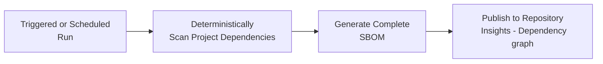
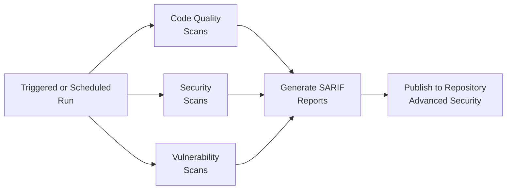
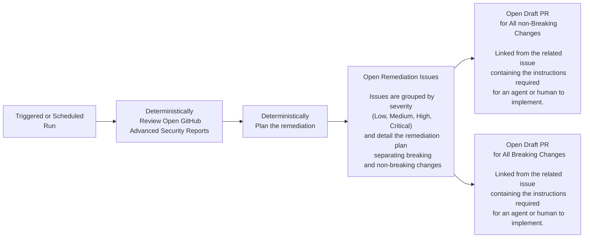
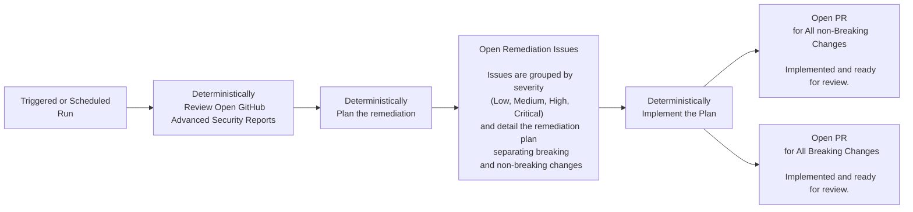

# Security and Vulnerability Remediation Scaffolding

> [!NOTE]
> These tools are in the early stages and are a work in progress.

> [!WARNING]
> We have a running naming issue, the term `Agent/agent` such as and in the `/security-remediation-agent/src/agents/***_agent.py` are too loosely utitlized.
> These artifacts are better termed LangChain workflows invoking tools and being AI ready but not remotely an agent in the AI agentic sense.
>
> A future enhancement will clean up this misnomer and tighten the definitions within the code base and the documentation.
>
> So we ask the reader to please trust the stressed point below of this solution as not being agentic in nature. As the maintainers respect the ministries concerns.

The purpose of this project is to provide a reusable set of automation tools for managing Security and Vulnerability Remediation within your project.

## Design Goal

Enable small teams with small budgets to effectively manage security and vulnerability remediation across multiple projects in a consistent manner.

## Key Features

- Enable early detection of security and vulnerability issues.  Enabling teams to actively identify and address issues as they arise.
- Enable workflows to be gated on the presence or absence of security and vulnerability issues.
- Reusability.
- Easily integrated into any project.
- Provide support for triggered and scheduled scanning.
- Unattended processes that naturally fits into the project and development workflow.
  - Results are presented as a discrete set of issues and related PRs that are easily managed.
    - PRs are rolled up into breaking and non-breaking changes.
- Utilizes readily available tools and integrates them with the GitHub dependency and advanced security tooling enabling a more complete picture and powerful feedback loops.
- Minimizes use of coding agents
  - This is a key factor when utilizing the reusable actions and workflows within GitHib organizations such as the BC Gov orgs where cloud agents are unavailable due to security concerns and complications related to agent licensing and execution within an organization.

## Current State

The tooling, once integrated with your project, will:
1. Scan your project dependencies and keep your project's dependency graph complete, up to date, and published within the repository's Dependency graph.
2. Perform code quality and vulnerability scanning and publish the results to the GitHub Advanced Security reports.
3. Perform these scans against each PR, and on a scheduled basis.

These actions alone:
1. Provide a more complete picture of your project's current security posture.
2. Enable the tools within GitHub, such as dependabot, to perform a much more comprehensive job.
3. Enables gated workflows to be created.  For example:
    - Fail PRs when there are critical quality, security, or vulnerability issues detected.
    - Stop code from being deployed when there are critical quality, security, or vulnerability issues detected even in an active deployment pipeline.

The workflows and actions then use deterministic processes to scan the results and rolled up issues and PRs which are intended to minimize human review efforts, rather than simply generating the typical slew of PRs one typically sees with Dependabot and other tools.  That slew of PRs will still be generated, but can be ignored as the rolled up PRs cover the issues.

At this stage the rollup PRs are drafts containing the instructions and details needed for a human or agent to fill in the implementation.  Since cloud agents are unavailable in the BCGov orgs (for good reasons mentioned above) the PRs can not be directly assigned to an agent in the main repo.  A developer would have to fork the repo into an org that allows cloud agents or run the agent processes locally in their development environment.  Since this violates the primary design goal (low effort) the team is investigating ways to replace the argentic requirement with additional deterministic tooling to enable complete remediation PRs to be presented without agent evolvement.

### High Level Workflows

#### Dependency Graph

#### Vulnerability and Quality

#### Remediation - Current State

#### Remediation - Future State

## Design Documentation

- [Security Remediation Agent Design](./docs/workflows/security-remediation-agent-design.md)

## Workflow Details

- [GitHub Actions workflows](./docs/workflows/osv-scanner.md)
- [Dependency Graph Refresh Workflow](./docs/workflows/dependency-graph-refresh.md)

## Contributing

This project is intended to be an open community project, where contributions are encouraged and welcome.

Please feel free to contribute.  Don't be shy.
- Make a fork, make a change, add a new feature, submit a PR.  This is the best way to make the project better.
- Open an issue - Report a bug, suggest a new feature, provide feedback.
